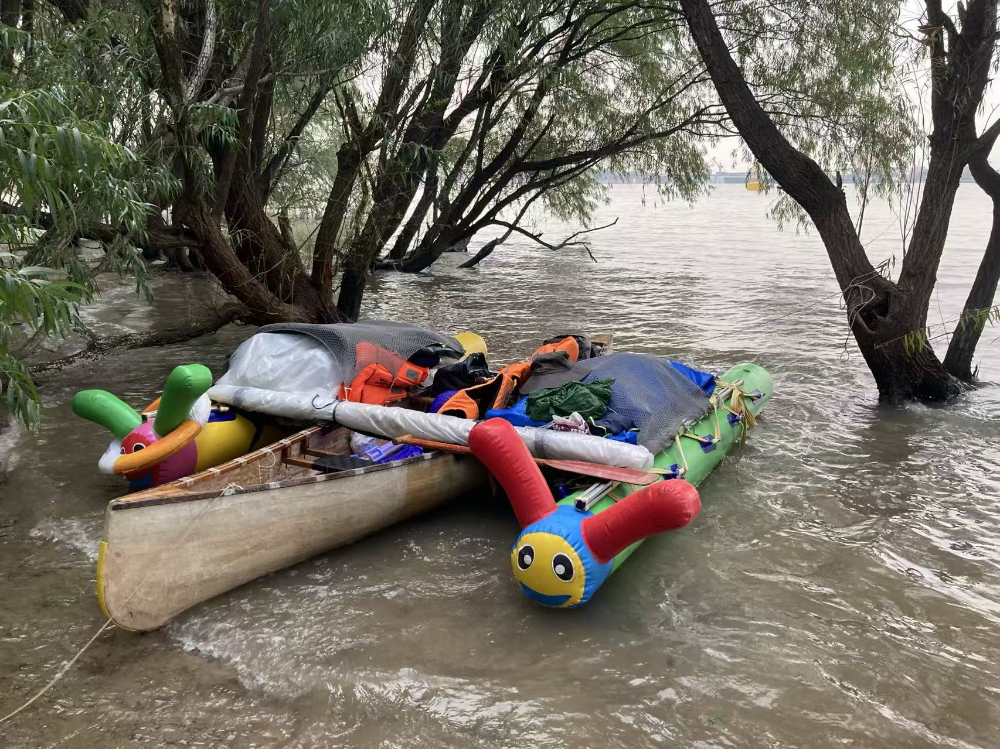

# 顺流而下小组（龚豪、子杰和园子园）沿长江从武汉划船到上海共1200公里31天。
  SHUNLIUERXIAorFRTS towards COOP(Gonghao, Zijie and Yuanziyuan), paddled down the Yangtze from Wuhan to Shanghai 1200km for 31days.

## 众筹的造船工作坊
Canoeworkshop towards COOP, 20jun - 20 jul, 2025: https://canoeworkshop2coop.github.io/

## 顺流而下
SHUNLIUERXIAorFRTS towards COOP, 20sep - 15nov, 2025: https://shunliuerxia2coop.github.io/

三个武汉的艺术家划着自己做的独木舟（Canoe），从长江顺流而下；他们沿途岸边野餐，邀请不同的朋友相遇、聊天、上船玩，最终到达上海。他们的行为，和这个艺术小组的名字，都叫From the River to the Sea towards COOP，从武汉到上海是沿着长江顺流而下，是from the (Yangtze-)river to the (East China) Sea. 微软和Github对这句话有审查，repo页面404，githubpages页面404，账户要删得开工单；只得另用名号。此记。

……龚豪在几年前借了一艘船想顺长江到下游去，结果事情一直没开始，船先玩坏了。这几年里不坚定的（无？）目的感，和拖沓享乐的日复日、以及不稳定的生活，刚好让各种事件在时间韧度里发酵，让朋友们持续地和船、和更多朋友有更多的相处，在武汉这个与水相关联的城市里闹了不少动静。（*见系列事件和相关纪录片《路上行舟》、《武汉过年七天乐》序列等。）龚豪和子杰、园子园等朋友造了船还给原主人，并对旧船改造开始了顺流而下到上海的旅程。沿途他们会同步更新动态/直播；邀请朋友们来一起相聚、聊天和在江边野餐，分享厨艺和美食，聊聊我们的长江、可爱江豚还有微小而适用的技术；邀请不同的朋友登船加入航行。他们到达上海后，沿江拜访艺术家、工作室和美术馆。

Three artists from Wuhan are paddling their handmade canoe down the Yangtze River to Shanghai. Along the way, they picnic by the riverbank, inviting various friends to meet, chat, and join them on their journey. They recently just arrived in Shanghai. Their activities, along with the name of this art group, are called "From the River to the Sea towards COOP", for the journey from Wuhan to Shanghai flows along the Yangtze River, which can be interpreted as "from the (Yangtze) River to the (East China) Sea", which phrase has being censored by Microsoft and GitHub, resulting in 404 errors on both the repo page and the GitHub Pages and even othermore trouble things;then, a different name must be used. This is recorded here.

...4 years ago, Gong Hao borrowed a boat with the intention of traveling downstream on the Yangtze River, but the plan never got off the ground, and the boat ended up getting damaged. Over the years, a wavering sense of purpose, along with the day-to-day indulgence of procrastination and an unstable lifestyle, has allowed various events to unfold over time. This has enabled friends to spend more time with the boat and each other, creating quite a stir in Wuhan, a city closely tied to water. (*See the series of events and related documentaries such as "GO to Street with Boat towards COOP" and "HAPPY CHINESE NEWYEAR AND SEVEN DAYS TOWARDS COOP video sequence", etc.) Gong Hao and his friend Zijie and yuanziyuan, make a new boat to returned to its original owner, then repaired the oldone to began their journey downstream to Shanghai. Along the way, they invite friends to gather, chat, and picnic by the river, sharing culinary skills and delicious food, discussing the Yangtze River, the lovable Yangtze finless porpoise, and small yet appropriate technologies, as well as inviting different friends to board and join the journey.Recently, they arrived in Shanghai and might continue along the Huangpu River to the city center, visiting artists, studios, museum, and galleries.

